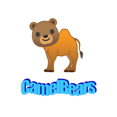

# 2021  Practicum October Code Jam

Our project for the Practicum 2021 October code-jam.

## [The project on GitHub Pages](https://bar-amit.github.io/code-jam/)

## Technologies

In our project we used HTML, CSS and  vanilla JavaScript only.

## Contributors

Team camelBears: Bar Amit, Alon Goykhman and designer Konstantin Slizkov.

